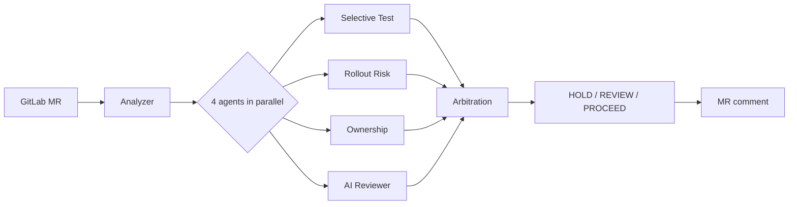

# ReleaseGuard

**[English](./README.md) · [繁體中文](./README.zh-TW.md)**

> MR-level release gating: four specialised agents inspect the diff in parallel; an arbitration layer collapses their signals into a single **HOLD / REVIEW / PROCEED** recommendation that lands at the top of the MR comment.

## Why this exists

Traditional CI runs the full test suite plus rule checks and reports a single red/green bit. Real release risk isn't that flat — a single diff simultaneously touches "which tests need to run", "how risky is the rollout", "who knows this code", and "any code-level anti-patterns?". Squashing those four orthogonal views into one pass/fail throws away the signal that reviewers actually need.

ReleaseGuard splits these views into four specialised agents that run in parallel and emit structured signals, then a Decision Arbitration Layer collapses them into one actionable recommendation. The reviewer opens the MR and sees the verdict (`HOLD / REVIEW / PROCEED`) plus the specific `triggered_signals` that drove it.

## Visual proof

Three MR comments produced by `docker compose up` against the local harness — the same analyzer code path, three different diffs, three different recommendations:

<table>
  <tr>
    <td><a href="docs/screenshots/proceed.png"></a></td>
    <td><a href="docs/screenshots/review.png"></a></td>
    <td><a href="docs/screenshots/hold.png"></a></td>
  </tr>
  <tr>
    <td align="center"><b>✅ PROCEED</b><br/>docs-only change</td>
    <td align="center"><b>🟡 REVIEW</b><br/>handler + config drift (4 medium zones)</td>
    <td align="center"><b>🔴 HOLD</b><br/>critical drift in secrets config</td>
  </tr>
</table>

Side-by-side breakdown plus the Topology 0 integration validation (real LCOV + reverse BFS over 17K symbols) live in [`docs/case_study.md`](docs/case_study.md).

## How it works



Full pipeline, T0/T1 topology comparison, and the arbitration decision matrix (three mermaid diagrams) are in [`docs/architecture.md`](docs/architecture.md).

## Design highlights & trade-offs

- **Many insights → one decision.** The arbitration layer reconciles "four views speak at once" with "the reviewer wants one clear call". The `triggered_signals` array keeps every contributing signal traceable.
- **Ownership stays neutral.** No reviewer scores, no auto-written approval rules, and the suggestion order is shuffled (a lint test enforces `score` / `kind` are not present in the JSON schema). The system surfaces "who has touched this area" without making personnel judgements.
- **L1 / L2 / L3 confidence ladder.** Selective Test degrades gracefully: path heuristics (confidence 0.6) → `coverage_map` intersect (0.75) → callgraph reverse BFS with a dynamic-ratio confidence penalty (0.9). Real coverage is generated by `cmd/cover2lcov`, which runs `go test -coverprofile` per `Test*` across the whole repo and converts the output to LCOV before feeding the indexer — not a hand-crafted seed.
- **Topology 1 invites the zero-infra adopter.** The full topology needs Postgres + a nightly indexer; Topology 1 runs the analyzer container alone (degraded but usable), so an infrastructure prerequisite never blocks the first taste.

## Quick start

```bash
make build
./bin/analyzer
```

## Local end-to-end demo

```bash
cd deploy/compose
mkdir -p artifacts
docker compose up --build --abort-on-container-exit
for f in artifacts/note-proj*.md; do echo "=== $f ==="; cat "$f"; echo; done
```

Three analyzer instances run in parallel against a mock GitLab and post the three arbitration outcomes (PROCEED / REVIEW / HOLD) as separate MR comments. See [`deploy/compose/README.md`](deploy/compose/README.md) for details.

## Caller usage

```yaml
include:
  - project: 'platform/releaseguard'
    ref: main
    file: 'deploy/ci/releaseguard.yaml'

releaseguard-review:
  extends: .releaseguard-full
  variables:
    TARGET_SERVICE_NAME: my-service
    TARGET_SERVICE_TYPE: backend
```

## Documentation

- [`docs/case_study.md`](docs/case_study.md) — three MR-comment outcomes side by side, with analysis.
- [`docs/architecture.md`](docs/architecture.md) — pipeline / topology / decision-matrix mermaid diagrams.
- [`docs/learnings.md`](docs/learnings.md) — design reflections ("what I learned from making these decisions").
- [`docs/decisions_log.md`](docs/decisions_log.md) — seventeen design pivots in "initial idea → why wrong → current → lesson" form.
- [`docs/one_pager.md`](docs/one_pager.md) — single-page summary for sharing.
- [`docs/spec/`](docs/spec/) — full spec (ten design docs plus four implementation plans under `superpower/`).
- [`deploy/compose/README.md`](deploy/compose/README.md) — local-harness instructions.
