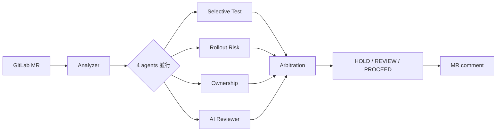

# ReleaseGuard

**[English](./README.md) · [繁體中文](./README.zh-TW.md)**

> MR 級別的 release 風險閘門：四個專責 agent 並行檢視 diff，由仲裁層收斂成單一 **HOLD / REVIEW / PROCEED** 建議，貼回 MR comment 最頂層。

## 為什麼需要這個系統

傳統 CI 跑全量測試 + 規則檢查，只回答「綠 / 紅」這個二元問題。但真實 release 的風險判斷不只如此——一份 diff 同時牽涉「該跑哪些測試」、「rollout 風險多高」、「該找誰 review」、「程式碼層面有沒有 anti-pattern」這四個正交視角，CI 把它們全壓成一條 pass/fail 等於把訊號丟掉。

ReleaseGuard 把這四個視角拆成四個專責 agent 並行產出結構化訊號，再透過 Decision Arbitration Layer 收斂成單一可行動的 recommendation，讓 reviewer 在打開 MR 時就能直接看到「此 PR 該停 / 該複審 / 可放行」與背後具體的 triggered_signals。

## 視覺證據

以下三份 MR comment 由 `docker compose up` 在 local harness 實際跑出——同一份 analyzer code path，三種不同的 diff 觸發三種不同的 recommendation：

<table>
  <tr>
    <td><a href="docs/screenshots/proceed.png"></a></td>
    <td><a href="docs/screenshots/review.png"></a></td>
    <td><a href="docs/screenshots/hold.png"></a></td>
  </tr>
  <tr>
    <td align="center"><b>✅ PROCEED</b><br/>純文件變更</td>
    <td align="center"><b>🟡 REVIEW</b><br/>handler + config drift（4 個 medium zone）</td>
    <td align="center"><b>🔴 HOLD</b><br/>secrets 設定有 critical drift</td>
  </tr>
</table>

完整三段對比 + Topology 0（真實 LCOV + 17K symbols 反向 BFS）整合驗證見 [`docs/case_study.md`](docs/case_study.md)。

## 如何運作



完整 pipeline、拓撲對照（T0 / T1）、決策矩陣三張 mermaid 圖見 [`docs/architecture.md`](docs/architecture.md)。

## 設計亮點與取捨

- **Many insights → one decision**：仲裁層讓「四個視角同時表態」與「reviewer 只想要一個明確建議」兩個需求不衝突。triggered_signals 機制保留每一條訊號的可回溯性。
- **Ownership 中性化**：刻意不給 reviewer 打分數、不寫 approval rule、輸出順序隨機化（lint 強制無 `score` / `kind` 欄位）。系統只負責提示「誰熟這塊」，不替團隊做人事判斷。
- **L1 / L2 / L3 信心階梯**：Selective Test 由「路徑啟發」（信心 0.6）→「coverage_map intersect」（0.75）→「callgraph 反向 BFS + dynamic-ratio 信心懲罰」（0.9）三階下降，DB 在不在都能跑出可用結果。真實 coverage 由 `cmd/cover2lcov` 對全 repo 每個 `Test*` 跑 `go test -coverprofile` 後轉 LCOV 餵 indexer，非 hand-crafted seed。
- **Topology 1 補位 zero-infra adopter**：完整版需要 Postgres + nightly indexer，但「想試水溫」的使用者只跑 analyzer 容器即可（功能降級但結果仍可用）——避免基礎建設門檻把早期採用者擋在外面。

## 快速開始

```bash
make build
./bin/analyzer
```

## Local end-to-end demo

```bash
cd deploy/compose
mkdir -p artifacts
docker compose up --build --abort-on-container-exit
for f in artifacts/note-proj*.md; do echo "=== $f ==="; cat "$f"; echo; done
```

三個 analyzer 實例平行對 mock GitLab 跑，各自貼出對應 PROCEED / REVIEW / HOLD 三種仲裁結果的 MR comment。詳見 [`deploy/compose/README.md`](deploy/compose/README.md)。

## Caller usage

```yaml
include:
  - project: 'platform/releaseguard'
    ref: main
    file: 'deploy/ci/releaseguard.yaml'

releaseguard-review:
  extends: .releaseguard-full
  variables:
    TARGET_SERVICE_NAME: my-service
    TARGET_SERVICE_TYPE: backend
```

## 文件索引

- [`docs/case_study.md`](docs/case_study.md) — 三段 MR comment 實況對比與分析
- [`docs/architecture.md`](docs/architecture.md) — Pipeline / Topology / 決策矩陣三張 mermaid 圖
- [`docs/learnings.md`](docs/learnings.md) — 設計反思（從這些決定中我學到什麼）
- [`docs/decisions_log.md`](docs/decisions_log.md) — 17 個關鍵設計轉折的「初版 → 為何錯 → 現在 → 學到什麼」
- [`docs/one_pager.md`](docs/one_pager.md) — 單頁分享版（問題 / 方法 / 成果）
- [`docs/spec/`](docs/spec/) — 完整 spec（10 份規格 + 4 份實作 plan 在 `superpower/`）
- [`deploy/compose/README.md`](deploy/compose/README.md) — local harness 的跑法
