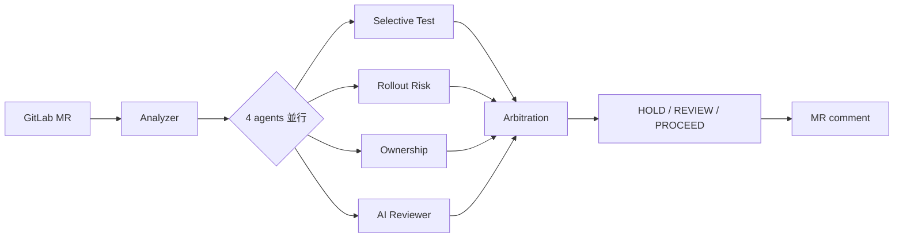

# ReleaseGuard

**[English](./README.md) · [繁體中文](./README.zh-TW.md)**

[](https://github.com/twjohnwu/releaseGuard/actions/workflows/ci.yml) [](https://github.com/twjohnwu/releaseGuard/releases) 

> MR 級別的 release 風險閘門：四個專責 agent 並行檢視 diff，由仲裁層收斂成單一 **HOLD / REVIEW / PROCEED** 建議，貼回 MR comment 最頂層。

## 為什麼需要這個系統

傳統 CI 跑全量測試 + 規則檢查，只回答「綠 / 紅」這個二元問題。但真實 release 的風險判斷不只如此——一份 diff 同時牽涉「該跑哪些測試」、「rollout 風險多高」、「該找誰 review」、「程式碼層面有沒有 anti-pattern」這四個正交視角，CI 把它們全壓成一條 pass/fail 等於把訊號丟掉。

ReleaseGuard 把這四個視角拆成四個專責 agent 並行產出結構化訊號，再透過 Decision Arbitration Layer 收斂成單一可行動的 recommendation，讓 reviewer 在打開 MR 時就能直接看到「此 PR 該停 / 該複審 / 可放行」與背後具體的 triggered_signals。

## 視覺證據

以下三份 MR comment 由 `docker compose up` 在 local harness 實際跑出——同一份 analyzer code path，三種不同的 diff 觸發三種不同的 recommendation：

<table>
  <tr>
    <td><a href="docs/screenshots/proceed.png"></a></td>
    <td><a href="docs/screenshots/review.png"></a></td>
    <td><a href="docs/screenshots/hold.png"></a></td>
  </tr>
  <tr>
    <td align="center"><b>✅ PROCEED</b><br/>純文件變更</td>
    <td align="center"><b>🟡 REVIEW</b><br/>handler + config drift（4 個 medium zone）</td>
    <td align="center"><b>🔴 HOLD</b><br/>secrets 設定有 critical drift</td>
  </tr>
</table>

完整三段對比 + Topology 0（真實 LCOV + 17K symbols 反向 BFS）整合驗證見 [`docs/case_study.md`](docs/case_study.md)。

## 如何運作



完整 pipeline、拓撲對照（T0 / T1）、決策矩陣三張 mermaid 圖見 [`docs/architecture.md`](docs/architecture.md)。

## 設計亮點與取捨

- **Many insights → one decision**：仲裁層讓「四個視角同時表態」與「reviewer 只想要一個明確建議」兩個需求不衝突。triggered_signals 機制保留每一條訊號的可回溯性。
- **Ownership 中性化**：刻意不給 reviewer 打分數、不寫 approval rule、輸出順序隨機化（lint 強制無 `score` / `kind` 欄位）。系統只負責提示「誰熟這塊」，不替團隊做人事判斷。
- **L1 / L2 / L3 信心階梯**：Selective Test 由「路徑啟發」（信心 0.5）→「coverage_map intersect」（0.75）→「callgraph 反向 BFS + dynamic-ratio 信心懲罰」（0.9）三階下降，DB 在不在都能跑出可用結果。真實 coverage 由 `cmd/cover2lcov` 對全 repo 每個 `Test*` 跑 `go test -coverprofile` 後轉 LCOV 餵 indexer，非 hand-crafted seed。
- **Topology 1 補位 zero-infra adopter**：完整版需要 Postgres + nightly indexer，但「想試水溫」的使用者只跑 analyzer 容器即可（功能降級但結果仍可用）——避免基礎建設門檻把早期採用者擋在外面。

## 實作狀態

Plan A / B / C 已完成（見 CHANGELOG.md）。Plan D（RAG）只有 spec，尚未實作。AI Reviewer 的 RAG 相關部分仍停留在設計階段：

| 能力 | 狀態 |
|---|---|
| AI Reviewer Channel A（prompt stacking） | ✅ 已實作 |
| AI Reviewer Channel B（RAG：vector + BM25 檢索） | ❌ 僅規格 |
| AI Reviewer self-reflection | ❌ 只有 config flag（`RG_REVIEWER_SELF_REFLECTION`），無邏輯 |
| Plan D RAG pipeline（embedding backfill + 檢索） | ❌ 僅規格 |

延後的設計見 `docs/spec/task_ai_reviewer.md` 與 `docs/spec/superpower/plan_d_rag.md`。

## 快速開始

```bash
make build
./bin/analyzer
```

預建 image：`docker pull ghcr.io/twjohnwu/releaseguard-analyzer:0.1.0`（另有 `releaseguard-indexer`），每個 `v*` tag 都會發佈。

## Local end-to-end demo

```bash
cd deploy/compose
mkdir -p artifacts
docker compose up --build --abort-on-container-exit
for f in artifacts/note-proj*.md; do echo "=== $f ==="; cat "$f"; echo; done
```

三個 analyzer 實例平行對 mock GitLab 跑，各自貼出對應 PROCEED / REVIEW / HOLD 三種仲裁結果的 MR comment。詳見 [`deploy/compose/README.md`](deploy/compose/README.md)。

## Caller usage

```yaml
include:
  - project: 'platform/releaseguard'
    ref: main
    file: 'deploy/ci/releaseguard.yaml'

releaseguard-review:
  extends: .releaseguard-full
  variables:
    RG_SERVICE_NAME: my-service
    RG_SERVICE_TYPE: backend
```

設定 `AGENT_TIMEOUT_SEC` 可單獨限制每個 agent 的時間；預設等於 `ANALYZE_TIMEOUT_SEC`，且不得超過它。取消是透過 `context` 合作式進行，agent 內部卡住的 syscall（例如 `PROJECTS_DIR` 底下掛載停擺）不會被中斷。

## 成本

只有 AI Reviewer 會呼叫付費 LLM API，其餘三個 agent 都是純 Go。每個 MR reviewer 大致送出：

| 組成 | Tokens |
|---|---|
| System prompt（堆疊的 `.md` context） | 約 3k–5k input |
| MR diff + 摘要 | 約 2k–10k input |
| 結構化 findings（tool-use JSON） | 約 0.5k–2k output |

以 Sonnet 級定價（`claude-sonnet-4-6`：$3 / 1M input、$15 / 1M output）估算，每個 MR 約 **$0.05–0.30**。diff 越大或改用更貴的 model，成本等比上升。

Model 可透過 **`RG_AI_MODEL`** 設定（預設 `claude-sonnet-4-6`），填任何當前 Claude model id（如 `claude-opus-4-8`、`claude-haiku-4-5`）即可在成本與能力間取捨。設 `RG_AGENT_AI_REVIEWER_ENABLED=false` 可完全關閉 reviewer，達成零 API 呼叫。

## Feedback loop（誤報回饋）

HOLD / REVIEW gate 可能誤判。為了量化這件事，每則 HOLD/REVIEW 的 MR comment 結尾都附一行邀請：若 reviewer 認為 gate 判錯了，就在該 MR 加上 label **`releaseguard:false-positive`**。

接著用 `feedback` 子指令掃描近期已合併的 MR，把 ReleaseGuard 自己的決策（從 MR comment 解析）跟這個 label 比對，印出 MVP precision 報告：

```bash
# 預設掃 CI_PROJECT_ID；--project 可覆寫
./bin/analyzer feedback --project 42 --since 2026-01-01T00:00:00Z
# 機器可讀：
./bin/analyzer feedback --project 42 --json
```

Reviewer 也可以在 HOLD/REVIEW 的 MR 上加 **`releaseguard:confirmed`** label，記錄「這個判定是對的」。輸出統計 HOLD 次數、被標為 confirmed／誤報的 HOLD 數，以及下面這幾個 precision 指標。這是不需 Postgres 的 MVP——收集到的資料正是 selective-test 信心常數（`internal/agents/testselect/confidence.go`）等待校準的依據。

### Precision 報告的限制

`analyzer feedback` 一次輸出四個指標，不是一個：

- `confirmed_hold_precision_pct` — 只算被標成 `releaseguard:confirmed` 或 `releaseguard:false-positive` 的 HOLD；其他 HOLD 不計入分母。
- `weak_signal_hold_precision_pct` — 舊公式：所有沒標記的 HOLD 一律當「對」算。這就是舊版報告裡的 `precision_pct`。
- `confirmed_label_coverage_pct` — 有明確標記的 HOLD 佔比。
- `unlabeled_rate_pct` — 沒有任何標記的 HOLD 佔比。

沒標記的 HOLD **不代表**判定是對的——只代表還沒人看過。務必把 confirmed precision 跟 coverage 一起讀：coverage 低、confirmed precision 卻很高，通常是 selection bias（只有 reviewer 覺得順眼的案例被標記），不是可信的估計值。同一個 MR 同時掛 `releaseguard:confirmed` 和 `releaseguard:false-positive` 會被算成 `hold_conflict`，從所有百分比中排除。分母為零時百分比是 `null`（不是 `0`）。

## Replay 資料集

`analyzer replay --dataset <dir>` 會對 `<dir>/<case>/{diff.json,expected.json}` 內記錄的 MR diff 執行 deterministic selective-test 與 rollout-risk agents（不使用 AI 或 DB），並回報 exact match、`confirmed_hold_precision_pct`、`weak_signal_hold_precision_pct`、`confirmed_label_coverage_pct`、`unlabeled_rate_pct` 與 `missed_risk_count`。

```bash
go run ./cmd/analyzer replay --dataset testdata/replay --json
```

`testdata/replay/` 的 seed dataset 複製自 mock-gitlab fixtures，**不是真實 MR 資料**。真實已合併 MR 請用 `replay-import` 匯入（見下）。

`04-t0demo` 原本需要 Postgres 才能得到 L3 結果；只跑 deterministic agents 時結果是 `PROCEED`，因此它的 `expected.json` 記的是**觀察基線**，不是 ground truth。

`expected.json` 可以額外帶一個 `label` 物件，記錄人工判斷，跟 `recommendation` 字串是分開的：

```json
{
  "recommendation": "HOLD",
  "label": {
    "human_outcome": "correct",
    "evidence_source": "reviewer_comment",
    "derivation": "explicit",
    "confidence": "high",
    "evidence_ref": "https://gitlab.example.com/g/p/-/merge_requests/42#note_1",
    "reviewed_by": "jdoe",
    "reviewed_at": "2026-09-01T00:00:00Z"
  }
}
```

Enum 值（`internal/report/label.go`）：
- `human_outcome`：`correct`、`overcautious`、`missed_risk`、`unlabeled`
- `evidence_source`：`reviewer_comment`、`release_decision`、`post_merge_change`、`deployment`、`incident`
- `derivation`：`explicit`、`inferred`
- `confidence`：`high`、`medium`、`low`

`derivation: explicit` 代表人類直接說出結論，也是唯一會餵進 `confirmed_hold_precision_pct` 與 `confirmed_label_coverage_pct` 的標記種類。`derivation: inferred` 是 ReleaseGuard 自己推得的（例如從 `releaseguard:false-positive` label 推來），只餵進 `weak_signal_hold_precision_pct`——跟上面 feedback loop 限制段落一樣的 explicit-vs-inferred 分野：inferred 或沒標記，都不能證明判定是對的。`recommendation` 為空字串的 case 一律算 unlabeled，所有指標都跳過它。

`replay-import` 永遠不會寫出 `derivation: explicit`；匯入的標記只會是 `inferred`（來源 MR 帶 false-positive label 時，`human_outcome` 寫成 `overcautious`）或維持 `unlabeled`。要人工標記某個 case，直接編輯 `expected.json`，設 `derivation: explicit` 並補上 `reviewed_by`／`reviewed_at`。對同一個 case 重跑 `replay-import` 會保留已標成 `explicit` 的標記；要覆寫請加 `--force`。

### 匯入真實 MR

```bash
# GitLab：expected 由 ReleaseGuard 自己貼的 MR comment 推得
GITLAB_API_BASE=https://gitlab.example.com/api/v4 GITLAB_TOKEN=... \
  go run ./cmd/analyzer replay-import --source gitlab --project 42 --since 2026-01-01T00:00:00Z --out .replay

# GitHub：PR 沒有 ReleaseGuard comment，每個 case 都寫成 unlabeled（recommendation 留空）
GITHUB_TOKEN=... go run ./cmd/analyzer replay-import --source github --repo owner/name --since 2026-01-01T00:00:00Z --out .replay

# 用分層隨機抽樣取代全量匯入（第一批建議抽 30-50 筆做人工標記）：
go run ./cmd/analyzer replay-import --source gitlab --project 42 --sample 40 --seed 1 --out .replay

go run ./cmd/analyzer replay --dataset .replay
```

`expected.json` 的推導（GitLab）：取最新一則 `ReleaseGuard recommendation:` note 當 verdict；若 MR 同時帶 `releaseguard:false-positive` label 且 verdict 是 HOLD 或 REVIEW，expected 改為 `PROCEED`。沒有 ReleaseGuard note 的 MR 預設跳過，加 `--allow-unlabeled` 會寫成空的 `recommendation` 加 `"human_outcome": "unlabeled"`；`replay` 不把這類 case 算進 metrics，另列 `unlabeled`，等你手動補上 recommendation。對同一個 `--out` 重跑 `replay-import` 不會覆寫 label 為 `derivation: explicit` 的 `expected.json`；要覆寫請加 `--force`。

`--sample N --seed S`：不匯入全部已合併 MR，改成在 HOLD/REVIEW/PROCEED 三個 verdict 分層中做分層隨機抽樣，共取 `N` 筆（GitHub 匯入沒有 verdict，只有一個分層）。每層取 `ceil(N / 分層數)` 筆；同一個 seed 抽出的樣本是確定性的，重跑會拿到一樣的結果。抽樣大小與 seed 會記在 `.manifest.json` 的 `sample` 欄位下。第一批人工標記建議抽 30-50 筆。 加 `--allow-unlabeled` 時，沒有 ReleaseGuard note 的 MR 會自成第四層，每層變成 ceil(N/4)。

拿掉什麼、留下什麼：MR 標題、作者、描述、URL、note 內文一律不寫入。`diff.json` 保留檔案路徑與 patch 原文——那正是 agent 讀的訊號——所以這份資料是**去身份，不是匿名化的程式碼**。case 目錄用 hash 命名，唯一能把 hash 對回 project／MR 的是 `<out>/.manifest.json`。`.replay/` 與 `.manifest.json` 都在 .gitignore；只有在程式碼可公開時才把 case 搬進 `testdata/replay/`。

## 文件索引

- [`docs/case_study.md`](docs/case_study.md) — 三段 MR comment 實況對比與分析
- [`docs/architecture.md`](docs/architecture.md) — Pipeline / Topology / 決策矩陣三張 mermaid 圖
- [`docs/learnings.md`](docs/learnings.md) — 設計反思（從這些決定中我學到什麼）
- [`docs/decisions_log.md`](docs/decisions_log.md) — 20 個關鍵設計轉折的「初版 → 為何錯 → 現在 → 學到什麼」
- [`docs/one_pager.md`](docs/one_pager.md) — 單頁分享版（問題 / 方法 / 成果）
- [`docs/spec/`](docs/spec/) — 完整 spec（10 份規格 + 4 份實作 plan 在 `superpower/`）
- [`deploy/compose/README.md`](deploy/compose/README.md) — local harness 的跑法
