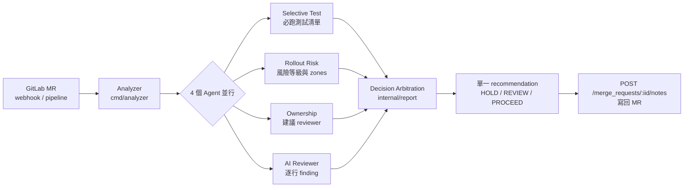
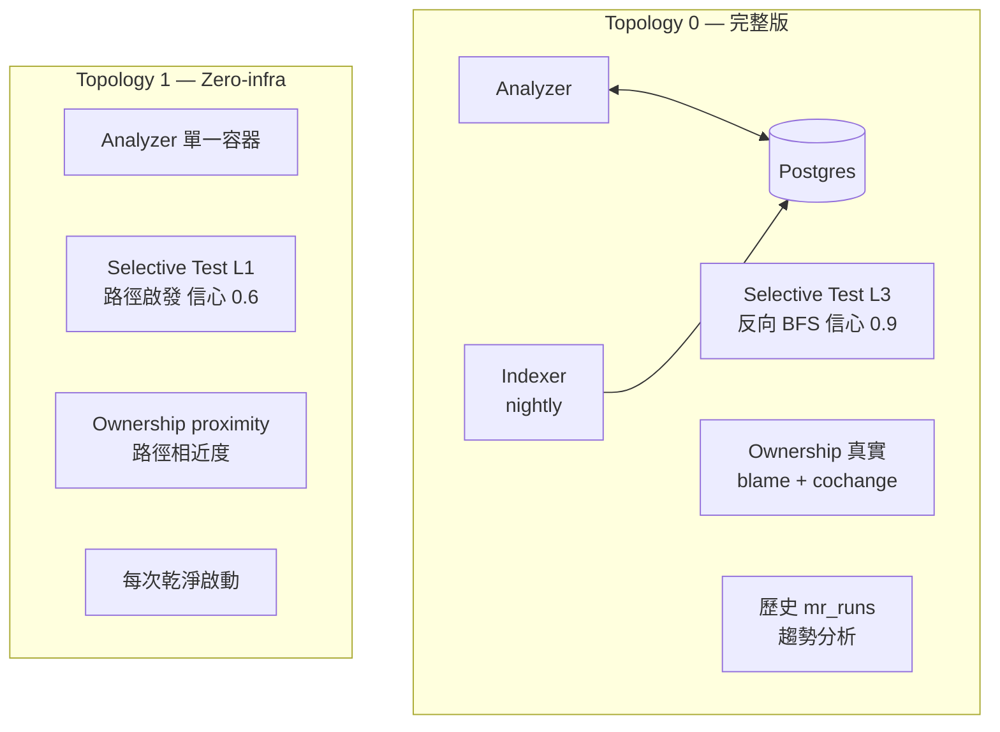
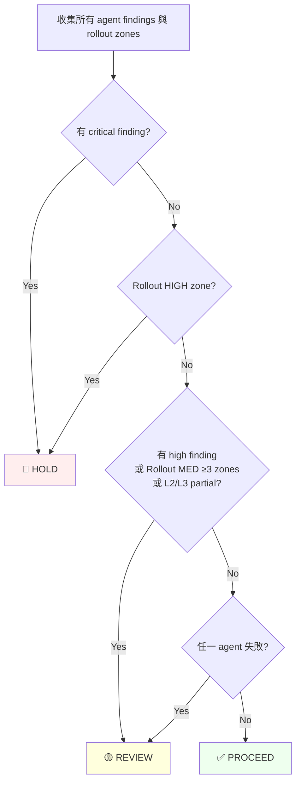

# 系統架構

ReleaseGuard 把一次 MR 級別的 release 風險判斷拆成四個正交視角，由四個專責 agent 並行產出結構化訊號，再經由仲裁層收斂成單一 recommendation 寫回 MR comment。本文件用三張 mermaid 圖呈現整體運作。

---

## 一、Pipeline：從 MR 到 MR comment

**設計取捨**：四個 agent 之間沒有資料相依，並行執行縮短 wall-clock time。每個 agent 的輸出格式都是統一的 `AgentOutput`（含 `findings[]` 與 metadata），讓仲裁層只需消費同一份介面、不需理解各 agent 內部邏輯。

---

## 二、Topology 對照：T0 vs T1

**設計取捨**：T0 capabilities 較強但需要 Postgres 與每日 indexer，門檻高；T1 砍掉 DB 與 indexer，僅靠當下 diff + 程式碼路徑就能跑——讓只想試水溫的早期使用者不必先架好基礎建設。同一份 analyzer code path、由 `TOPOLOGY` 環境變數切換降級策略，避免維護兩套程式碼。

---

## 三、決策矩陣：訊號如何收斂

**設計取捨**：仲裁層刻意保持規則式（不是 ML、不是 LLM），讓每個 PROCEED / REVIEW / HOLD 的判斷都能被回溯到具體的 triggered_signals 列表。Ownership 訊號**永遠不會**升級決策（它只負責建議 reviewer，不負責 gating）；L1 的部分命中**永遠不會**觸發 REVIEW（信心不足以強制人工介入）——這兩條規則把 agent 的「軟訊號」與閘門的「硬決策」明確切開。
