# ReleaseGuard 執行時序圖（PlantUML）

所有圖可直接貼到 https://www.plantuml.com/plantuml 渲染。

---

## 1. Overview Sequence

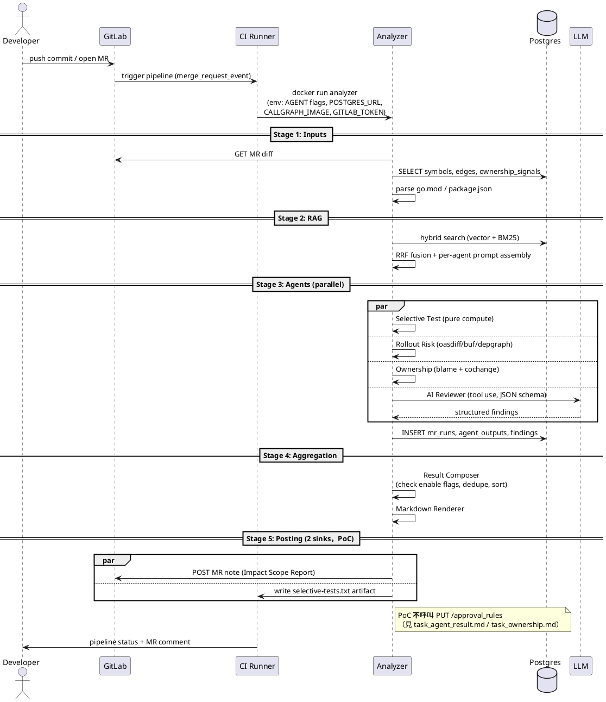

---

## 2. Stage 1 — Inputs Collection

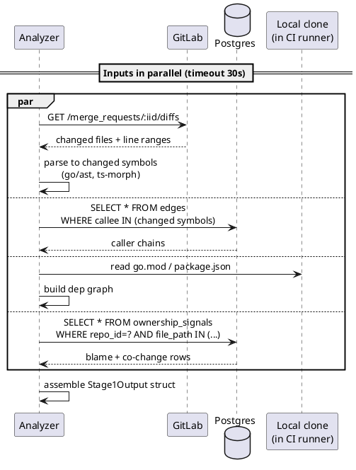

---

## 3. Stage 2 — Prompt Sources（Channel A + B + Hot Path）

### 3.1 Channel A — 靜態 base prompt（直讀檔）

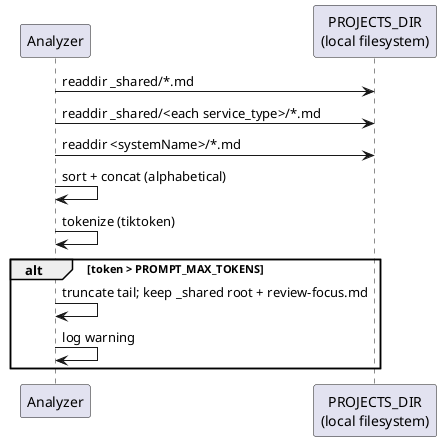

### 3.2 Channel B — 動態 RAG retrieval（查 Postgres）

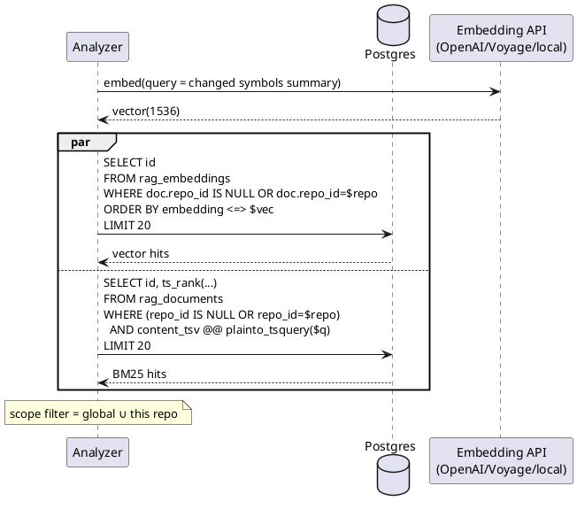

### 3.3 Hot Path — 對「本次 MR 自己」現場 embed（不寫回）

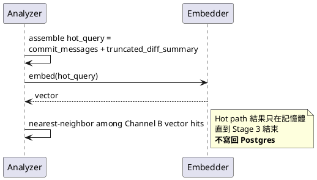

### 3.4 Fusion + Assembly

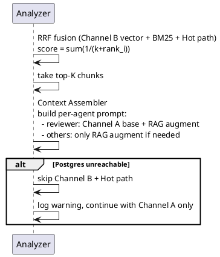

---

## 4. Stage 3 — Agents in Parallel

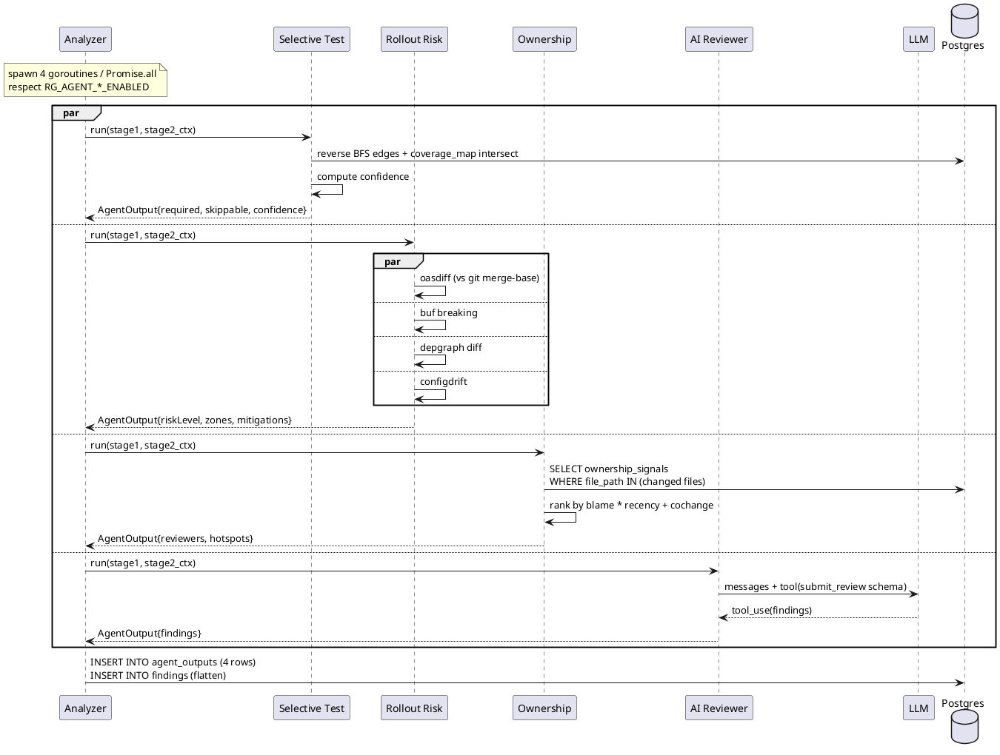

---

## 5. Stage 4 — Aggregation & Rendering

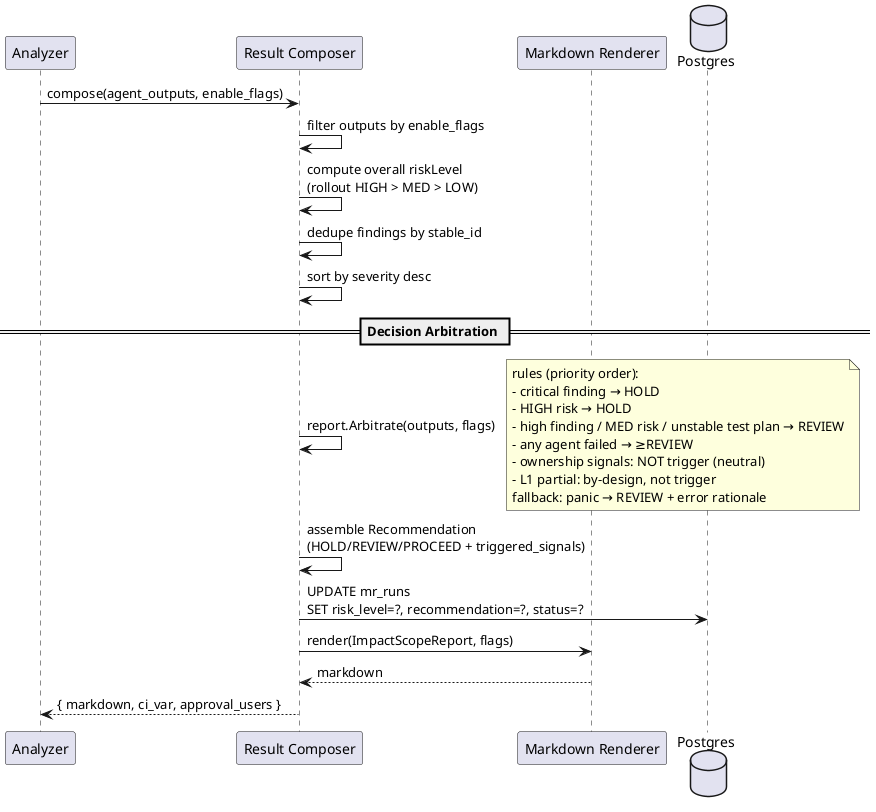

---

## 6. Stage 5 — Posting (2 sinks，PoC)

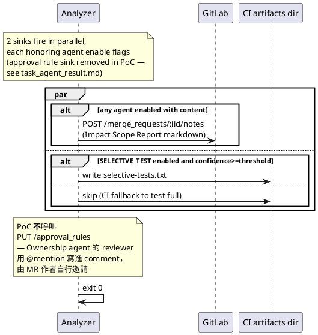

---

## 7. Failure / Timeout Flow

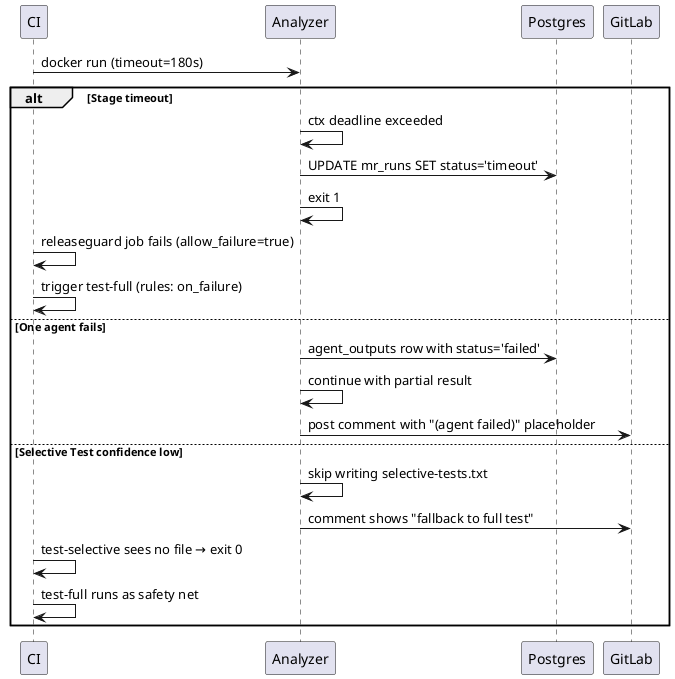

---

## 8. Indexer Cron Flow（與 analyzer 時序對照）

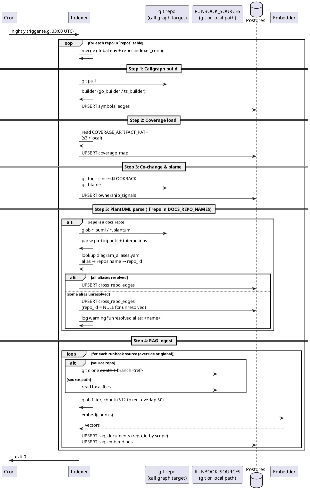

**時序對照**：
- 03:00 UTC indexer 跑（10~30 分鐘，視 repo 數）
- 之後一整天 analyzer 跑都 SELECT 同一份 snapshot
- Hot path 在 analyzer 端做、不影響 indexer

---

## 9. Backfill Flow（onboarding 用、手動觸發）

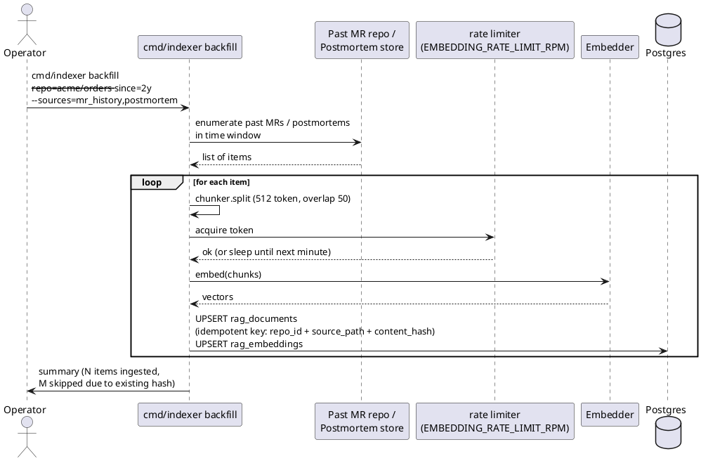

**特性**：
- **手動觸發、不排程**：onboarding 新 repo 時跑一次
- **idempotent**：用 `(repo_id, source_path, content_hash)` 當 unique key，重跑不重複
- **rate limit**：embedding API 每分鐘上限可控，避免一次性 ingest 觸發 provider 限流
- **不影響 nightly**：跑完的內容立刻可被 analyzer 查詢（同個 Postgres）
