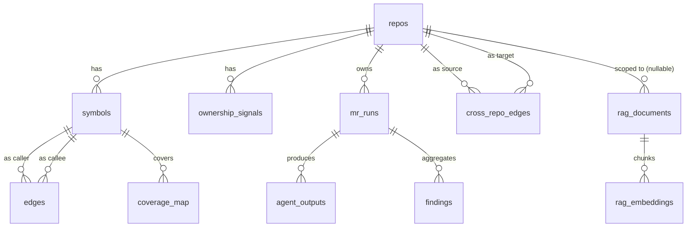

# Postgres Schema 設計

## ER 圖



---

## Tables

### `repos`

註冊在系統的 repo。analyzer 與 indexer 都以 `repo_id` 為作用域。

| Column | Type | Notes |
|---|---|---|
| `id` | `bigserial PK` | |
| `name` | `text UNIQUE NOT NULL` | e.g. `acme/orders` |
| `languages` | `jsonb NOT NULL` | `["go", "typescript"]` |
| `indexer_config` | `jsonb` | 見下方 example |
| `created_at` | `timestamptz DEFAULT now()` | |

`indexer_config` example：

```json
{
  "callgraph": {
    "include": ["./internal", "./cmd"],
    "exclude": ["**/vendor/**", "**/node_modules/**"]
  },
  "coverage_format": "lcov",
  "runbook_sources_override": [
    {
      "name": "team-orders-playbook",
      "repo": "git@gitlab.example.com:team-orders/playbook.git",
      "ref": "main",
      "globs": ["**/*.md"],
      "scope": "repo:acme/orders"
    }
  ]
}
```

`runbook_sources_override` 存在時，**取代**全域 `RUNBOOK_SOURCES`（不是合併），讓單一 repo 有自己的 runbook 源。

---

### `symbols` — Call graph 節點

| Column | Type | Notes |
|---|---|---|
| `id` | `text PK` | 全限定名 e.g. `acme/orders/handler.CreateOrder` |
| `repo_id` | `bigint FK → repos.id` | |
| `kind` | `text` | `function` / `method` / `class` |
| `language` | `text` | `go` / `typescript` |
| `file` | `text` | repo-relative |
| `line_start` | `int` | |
| `line_end` | `int` | |
| `signature` | `text` | |
| `hash` | `text` | sha256(body)，判斷 symbol 是否真改動 |
| `indexed_at` | `timestamptz` | |

索引：
- `idx_symbols_repo_file (repo_id, file)`
- `idx_symbols_hash (hash)`

---

### `edges` — Call graph 邊

| Column | Type | Notes |
|---|---|---|
| `id` | `bigserial PK` | |
| `caller` | `text FK → symbols.id` | |
| `callee` | `text FK → symbols.id` | |
| `call_file` | `text` | call site 所在檔 |
| `call_line` | `int` | |
| `kind` | `text` | `direct` / `interface` / `dynamic` |

索引（Selective Test 反向追蹤關鍵）：
- `idx_edges_callee (callee)` — reverse BFS
- `idx_edges_caller (caller)` — forward BFS
- `idx_edges_kind (kind)` — 統計 dynamic 比例

---

### `coverage_map` — Test ↔ 被覆蓋 symbol

由 indexer 從 CI artifact loader 寫入。

| Column | Type | Notes |
|---|---|---|
| `id` | `bigserial PK` | |
| `repo_id` | `bigint FK → repos.id` | |
| `test_id` | `text` | e.g. `TestOrderCreate` |
| `covered_symbol_id` | `text FK → symbols.id` | |
| `last_seen_sha` | `text` | 上次更新此筆的 commit |
| `updated_at` | `timestamptz` | |

索引：
- `idx_coverage_symbol (covered_symbol_id)` — symbol → tests
- `idx_coverage_repo_test (repo_id, test_id)`
- `UNIQUE (repo_id, test_id, covered_symbol_id)`

---

### `rag_documents`

| Column | Type | Notes |
|---|---|---|
| `id` | `bigserial PK` | |
| `source_type` | `text` | `profile` / `mr_history` / `schema` / `runbook` / `postmortem` / `plantuml`（PoC 全部實作） |
| `source_path` | `text` | 形如 `<runbook_source.name>/<relative_path>` |
| `repo_id` | `bigint FK → repos.id NULL` | NULL = global，由 `RUNBOOK_SOURCES[].scope` 決定（`global` → NULL；`repo:<name>` → 對應 id） |
| `content` | `text` | 原文 |
| `updated_at` | `timestamptz` | |

索引：
- `idx_rag_source (source_type, repo_id)`
- BM25：透過 `tsvector` 欄位 `content_tsv` + `GIN` index

---

### `rag_embeddings`（pgvector）

| Column | Type | Notes |
|---|---|---|
| `id` | `bigserial PK` | |
| `document_id` | `bigint FK → rag_documents.id` | |
| `chunk_idx` | `int` | |
| `chunk_text` | `text` | 對應的原文片段 |
| `embedding` | `vector(1536)` | OpenAI `text-embedding-3-small` 維度 |

索引：
- `ivfflat (embedding vector_cosine_ops)`

---

### `mr_runs`

每次 analyzer 執行的紀錄。

| Column | Type | Notes |
|---|---|---|
| `id` | `bigserial PK` | |
| `repo_id` | `bigint FK → repos.id` | |
| `mr_iid` | `int` | |
| `commit_sha` | `text` | |
| `started_at` | `timestamptz` | |
| `finished_at` | `timestamptz NULL` | |
| `status` | `text` | `running` / `ok` / `partial` / `failed` / `timeout` |
| `risk_level` | `text NULL` | `LOW` / `MED` / `HIGH`（由 result composer 寫入） |
| `recommendation` | `text NULL` | `HOLD` / `REVIEW` / `PROCEED`（由 Decision Arbitration Layer 寫入；詳見 `task_agent_result.md`） |
| `agents_enabled` | `jsonb` | snapshot of 4 flags |

索引：
- `idx_mrruns_repo_mr (repo_id, mr_iid, started_at DESC)` — 取某 MR 最新 run

---

### `agent_outputs`

| Column | Type | Notes |
|---|---|---|
| `id` | `bigserial PK` | |
| `mr_run_id` | `bigint FK → mr_runs.id` | |
| `agent` | `text` | `selective_test` / `rollout_risk` / `ownership` / `ai_reviewer` |
| `status` | `text` | `ok` / `partial` / `failed` |
| `duration_ms` | `int` | |
| `payload` | `jsonb NOT NULL` | 完整 `AgentOutput` JSON |

索引：
- `UNIQUE (mr_run_id, agent)`
- `idx_agent_outputs_agent (agent, status)`

---

### `findings` — 攤平的逐筆 finding

| Column | Type | Notes |
|---|---|---|
| `id` | `bigserial PK` | |
| `mr_run_id` | `bigint FK → mr_runs.id` | |
| `agent` | `text` | |
| `severity` | `text` | |
| `category` | `text` | |
| `title` | `text` | |
| `body` | `text` | |
| `location_file` | `text NULL` | |
| `location_line_start` | `int NULL` | |
| `location_line_end` | `int NULL` | |
| `suggestion` | `text NULL` | |
| `stable_id` | `text` | hash(agent+category+location+title)，跨 MR dedupe |

索引：
- `idx_findings_stable (stable_id)` — 跨 MR 比對
- `idx_findings_run (mr_run_id, severity)` — 渲染排序

---

### `ownership_signals` — 預計算的 blame + co-change

由 `cmd/indexer/cochange.go` nightly 重算。

> **僅內部使用、不對外暴露**：`blame_weight` 與 `recency_score` 是 Ownership agent **內部**用來篩 top-K 候選人的依據。PoC 階段這兩個 numeric score **不會**出現在 MR comment、agent JSON 輸出或任何使用者可見的地方（詳見 `task_ownership.md` 的對外定位）。schema 保留欄位是為了未來可改進清單裡的 ranking exposure 功能保留擴展空間。

| Column | Type | Notes |
|---|---|---|
| `id` | `bigserial PK` | |
| `repo_id` | `bigint FK → repos.id` | |
| `file_path` | `text` | repo-relative |
| `author` | `text` | git author email |
| `blame_weight` | `numeric(5,4)` | 0.0~1.0 |
| `co_change_files` | `jsonb` | `[{"file": "...", "score": 0.42}, ...]` |
| `recency_score` | `numeric(5,4)` | exp decay |
| `computed_at` | `timestamptz` | |

索引：
- `idx_owner_repo_file (repo_id, file_path)`
- `idx_owner_repo_author (repo_id, author)`

---

### `cross_repo_edges` — PlantUML 解析出的跨 repo call 關係

由 indexer Step 5 從 `DOCS_REPO_NAMES` 內 `.puml` / `.plantuml` 檔產出。`source_alias` / `target_alias` 是圖內 participant 名稱，透過 `diagram_aliases.yaml` 反查到 `repos.name`。

| Column | Type | Notes |
|---|---|---|
| `id` | `bigserial PK` | |
| `source_repo_id` | `bigint FK → repos.id NULL` | NULL 表示 alias 找不到對應 repo（unresolved） |
| `target_repo_id` | `bigint FK → repos.id NULL` | 同上 |
| `source_alias` | `text` | PlantUML 內 participant 原名（如 `FE`） |
| `target_alias` | `text` | 同上 |
| `call_kind` | `text` | `sync_call` / `async_event` / `db_query` / `unknown`（從 PlantUML 箭頭語意推 ） |
| `source_diagram_path` | `text` | 來源檔案，例如 `docs/api/checkout-flow.puml` |
| `indexed_at` | `timestamptz` | |

索引：
- `idx_xrepo_source (source_repo_id)` — 找該 repo 的下游
- `idx_xrepo_target (target_repo_id)` — 找該 repo 的上游
- `idx_xrepo_unresolved (source_alias, target_alias) WHERE source_repo_id IS NULL OR target_repo_id IS NULL` — 排查 unresolved alias

---

## 查詢範例

### Selective Test：給定改動的 symbol，反向找受影響的測試

```sql
WITH RECURSIVE upstream(sym, depth) AS (
  SELECT 'acme/orders/handler.CreateOrder', 0
  UNION
  SELECT e.caller, u.depth + 1
  FROM edges e JOIN upstream u ON e.callee = u.sym
  WHERE u.depth < 3
)
SELECT DISTINCT cm.test_id
FROM coverage_map cm
JOIN upstream u ON cm.covered_symbol_id = u.sym
WHERE cm.repo_id = $1;
```

### Ownership：取某檔案的 top reviewer

```sql
SELECT author, blame_weight * recency_score AS score
FROM ownership_signals
WHERE repo_id = $1 AND file_path = $2
ORDER BY score DESC
LIMIT 5;
```

### Cross-repo：找此 repo 的下游服務（影響圈）

```sql
SELECT DISTINCT r.name, e.call_kind, e.source_diagram_path
FROM cross_repo_edges e
JOIN repos r ON e.target_repo_id = r.id
WHERE e.source_repo_id = $1;
```

### RAG hybrid（vector + BM25 → RRF in app）

```sql
-- vector branch
SELECT id, 1 - (embedding <=> $1) AS score
FROM rag_embeddings ORDER BY score DESC LIMIT 20;

-- BM25 branch
SELECT id, ts_rank(content_tsv, plainto_tsquery($2)) AS score
FROM rag_documents WHERE content_tsv @@ plainto_tsquery($2)
ORDER BY score DESC LIMIT 20;
```

兩組結果在 application 層用 RRF 融合。

---

## Migration 順序

`migrations/0001_init.sql` ~ `migrations/000N_*.sql`：
1. `repos`、`symbols`、`edges`
2. `coverage_map`
3. `rag_documents`、`rag_embeddings`（須先 `CREATE EXTENSION vector`）
4. `mr_runs`、`agent_outputs`、`findings`
5. `ownership_signals`
